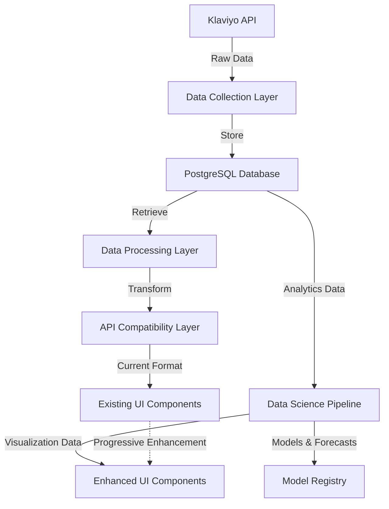

# Data Architecture Overview

## System Architecture

The Klaviyo Analytics Dashboard implements a multi-layered data architecture designed to support both real-time analytics and advanced data science capabilities.

## Key Components

### 1. Data Collection Layer
- Handles raw data ingestion from Klaviyo API
- Implements rate limiting and retry mechanisms
- Preserves complete API responses for future analysis
- Manages API authentication and error handling

### 2. Storage Layer
- PostgreSQL with TimescaleDB extension for time-series data
- Efficient storage of historical metrics and events
- Optimized for both real-time queries and batch analytics
- Implements data retention policies

### 3. Processing Layer
- Transforms raw data for frontend consumption
- Implements caching strategies for performance
- Handles data aggregation and enrichment
- Provides backward compatibility for existing features

### 4. Analytics Layer
- Supports advanced statistical analysis
- Implements forecasting and predictive models
- Provides cohort and segmentation analysis
- Enables custom metric calculations

### 5. Visualization Layer
- Maintains compatibility with existing UI components
- Provides enhanced visualization capabilities
- Supports real-time and historical data views
- Implements interactive analytics features

## Data Flow

1. **Collection**:
   - Regular polling of Klaviyo API endpoints
   - Storage of raw responses in database
   - Implementation of rate limiting protection

2. **Processing**:
   - Data normalization and cleaning
   - Metric calculation and aggregation
   - Cache management and updates

3. **Analysis**:
   - Statistical processing of historical data
   - Model training and evaluation
   - Generation of insights and predictions

4. **Presentation**:
   - Data transformation for frontend
   - Real-time metric updates
   - Historical trend visualization

## System Characteristics

### Performance
- Optimized query patterns for common operations
- Efficient caching strategies
- Batch processing for heavy computations

### Scalability
- Horizontal scaling capability
- Efficient data partitioning
- Resource usage optimization

### Reliability
- Multiple fallback mechanisms
- Comprehensive error handling
- Data consistency checks

### Security
- Secure API key management
- Data access controls
- Audit logging capabilities

## Integration Points

### Frontend Integration
- Backward compatible API endpoints
- Progressive enhancement of existing components
- Seamless transition for new features

### External Systems
- Klaviyo API integration
- Optional BI tool integration
- Model deployment infrastructure

## Next Steps

For detailed implementation information, refer to:
- [Database Schema Design](./database-schema.md)
- [Implementation Phases](./implementation-phases.md)
- [API Integration Details](./api-integration.md)
- [Analytics Implementation](./analytics-implementation.md)
