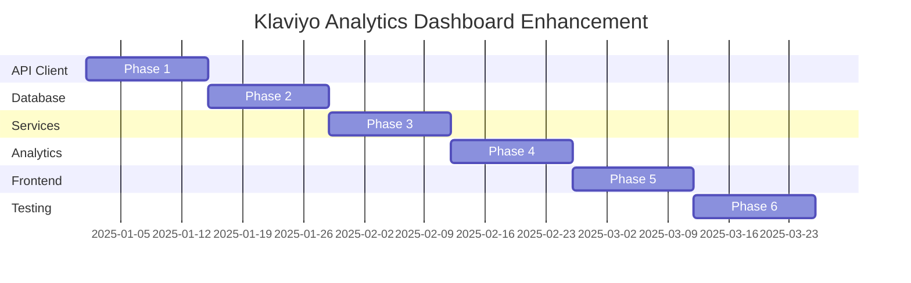
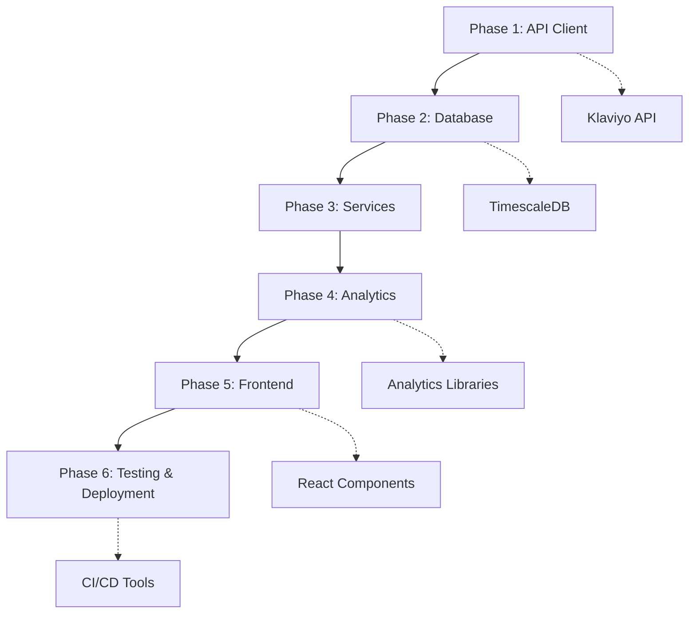

# Implementation Phases Overview

## Project Timeline: 12 Weeks

This document outlines the implementation phases for enhancing the Klaviyo Analytics Dashboard with advanced analytics capabilities and improved data persistence.

## Phase Overview

## Phase Details

### [Phase 1: API Client Modernization](./01-api-client-modernization.md) (Weeks 1-2)
- Update authentication mechanism
- Implement JSON:API parameter formatting
- Enhance rate limiting with dynamic backoff
- Update API client request methods

### [Phase 2: Database Implementation](./02-database-implementation.md) (Weeks 3-4)
- Set up PostgreSQL with TimescaleDB
- Create database schema
- Implement database connection
- Create data repository classes

### [Phase 3: Service Layer Enhancement](./03-service-layer-enhancement.md) (Weeks 5-6)
- Implement data sync service
- Create scheduler for regular sync
- Update controller layer
- Implement error handling

### [Phase 4: Analytics Engine](./04-analytics-engine.md) (Weeks 7-8)
- Implement basic time-series analysis
- Build forecasting models
- Create analytics API endpoints
- Create API routes for analytics

### [Phase 5: Frontend Integration](./05-frontend-integration.md) (Weeks 9-10)
- Update API client hooks
- Create enhanced chart components
- Implement analytics visualizations
- Add interactive controls

### [Phase 6: Testing and Deployment](./06-testing-and-deployment.md) (Weeks 11-12)
- Implement comprehensive testing
- Configure deployment
- Set up CI/CD pipeline
- Complete documentation

## Dependencies

## Success Criteria

Each phase has specific success criteria that must be met before moving to the next phase:

1. **API Client Modernization**
   - [ ] Bearer token authentication working
   - [ ] JSON:API parameter formatting implemented
   - [ ] Rate limiting with dynamic backoff working
   - [ ] Request queuing and deduplication functioning

2. **Database Implementation**
   - [ ] TimescaleDB successfully configured
   - [ ] Schema created with all tables and indexes
   - [ ] Repository classes implemented
   - [ ] Query performance requirements met

3. **Service Layer Enhancement**
   - [ ] Data sync service working
   - [ ] Scheduled jobs running correctly
   - [ ] Controllers using local database first
   - [ ] Error handling implemented

4. **Analytics Engine**
   - [ ] Time series analysis working
   - [ ] Forecasting models producing accurate predictions
   - [ ] API endpoints functioning
   - [ ] Performance requirements met

5. **Frontend Integration**
   - [ ] API client hooks implemented
   - [ ] Enhanced charts working
   - [ ] Analytics visualizations complete
   - [ ] UI responsive and accessible

6. **Testing and Deployment**
   - [ ] All tests passing
   - [ ] CI/CD pipeline working
   - [ ] Docker containers building
   - [ ] Documentation complete

## Risk Management

### Identified Risks
1. **API Rate Limiting**: Mitigated through intelligent rate limiting and caching
2. **Data Volume**: Addressed with TimescaleDB optimization
3. **Performance**: Monitored through comprehensive testing
4. **Integration Complexity**: Managed with phased approach

### Mitigation Strategies
- Regular testing throughout development
- Continuous monitoring and logging
- Phased rollout with feature flags
- Regular stakeholder reviews

## Next Steps

After completing all phases:
1. Monitor production deployment
2. Gather user feedback
3. Plan next iteration of improvements
4. Schedule regular maintenance
